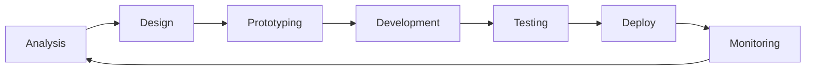

# 🧑🏻‍💻 Andrei Santana

<div align="center">
  
</div>

🇵🇹 [**Português**](translations/README_pt-PT.md) &nbsp;&nbsp;|&nbsp;&nbsp; 🇪🇸 [**Español**](translations/README_es.md)

## 💻 Tech Stack


## 👨‍💻 About Me

**Full Stack Developer** with **14+ years** of experience creating robust and scalable solutions. Specialist in **software architecture**, **technical leadership**, and **development best practices**.

My passion is transforming complex ideas into clean and efficient code, applying design patterns and agile methodologies to deliver real business value.

---

## 🛠️ Core Technologies

###  **PHP Ecosystem**

```php
<?php
// My preferred PHP stack
$expertise = [
    'frameworks' => ['Laravel', 'Zend Framework', 'CakePHP'],
    'patterns' => ['MVC', 'Repository', 'Service Layer', 'Factory'],
    'standards' => ['PSR-4', 'PSR-12', 'PSR-7', 'PSR-15'],
    'testing' => ['PHPUnit', 'Pest', 'TDD', 'BDD'],
    'tools' => ['Composer', 'PHP-CS-Fixer', 'PHPStan', 'Rector']
];
```

###  **JavaScript Universe**

```javascript
// Technologies I master in JS ecosystem
const stack = {
    frameworks: ["React", "Angular", "Vue.js"],
    runtime: ["Node.js", "Bun"],
    tools: ["Webpack", "Vite", "Babel", "TypeScript"],
    testing: ["Jest", "Cypress", "Vitest"],
    state: ["Redux", "Vuex", "Context API", "RxJS"],
};
```

### 🏗️ **Architecture & Patterns**

-   **Clean Architecture** - Clear separation of concerns
-   **SOLID Principles** - Extensible and maintainable code
-   **Design Patterns** - Factory, Strategy, Observer, Command
-   **API Design** - RESTful, GraphQL, API-First approach
-   **Microservices** - Decomposition and service communication
-   **Event-Driven Architecture** - Reactive and scalable systems

---

## 🎯 Areas of Expertise

### 💼 **Enterprise Solutions**

-   **ERP Systems** - Complete enterprise resource management
-   **SaaS Platforms** - Scalable multi-tenant applications
-   **E-commerce** - From MVPs to complex platforms
-   **CRM/CMS** - WordPress, Adobe Experience Manager
-   **APIs & Integrations** - Connecting heterogeneous systems

### 📊 **Marketing & Analytics**

-   **Digital Marketing** - Automations and campaigns
-   **Google Ecosystem** - Analytics, Tag Manager, Ads API
-   **Salesforce Marketing Cloud** - Journeys and automations
-   **Data Analytics** - ETL, dashboards and reporting
-   **Technical SEO** - Performance and optimizations

### ☁️ **DevOps & Infrastructure**

```yaml
# My DevOps approach
infrastructure:
    containers: [Docker, Kubernetes]
    cloud: [AWS, DigitalOcean]
    ci_cd: [GitHub Actions, GitLab CI, Jenkins]
    monitoring: [New Relic, Sentry, Grafana]

code_quality:
    version_control: [Git, GitFlow, Conventional Commits]
    code_review: [Pull Requests, Code Standards]
    testing: [Unit, Integration, E2E]
    deployment: [Blue-Green, Rolling, Canary]
```

---

## 🧪 Clean Code & Testing

### 📋 **Principles I Follow**

-   **Clean Code** - Code readable as prose
-   **TDD/BDD** - Tests as living documentation
-   **Refactoring** - Continuous code improvement
-   **Code Review** - Quality through collaboration
-   **Documentation** - Self-documented code and clear APIs

### 🧩 **Patterns & Practices**

-   **Repository Pattern** - Data access abstraction
-   **Service Layer** - Centralized business logic
-   **Dependency Injection** - Low coupling and high testability
-   **Event-Driven** - Asynchronous component communication
-   **Factory & Builder** - Flexible creation of complex objects

---

## 🎨 Frontend Expertise

### ⚛️ **Modern Frontend**

-   **Component Architecture** - Reusability and modularity
-   **State Management** - Complex data flows
-   **Performance** - Lazy loading, code splitting, PWA
-   **UX/UI** - Design systems and accessibility
-   **Mobile-First** - Responsive and progressive enhancement

### 🎛️ **CMS & Platforms**

-   **WordPress** - Themes, plugins, Gutenberg blocks
-   **Adobe Experience Manager** - Enterprise content management
-   **Headless CMS** - Strapi, Contentful, decoupled architectures
-   **E-commerce** - WooCommerce, Magento, custom solutions

---

## 🏢 Leadership & Architecture

### 👥 **Tech Leadership**

-   **Team Mentoring** - Developing developers
-   **Code Standards** - Establishing best practices
-   **Architecture Decisions** - ADRs and technical documentation
-   **Agile Methodologies** - Scrum, Kanban, sprint planning
-   **Knowledge Sharing** - Tech talks and code reviews

### 🏗️ **System Design**

-   **Scalability Planning** - Sustainable growth
-   **Performance Optimization** - Profiling and optimizations
-   **Security First** - OWASP, audits and best practices
-   **Database Design** - Efficient modeling and indexes
-   **Monitoring & Observability** - Logs, metrics and alerting

---

## 🚀 Projects & Solutions

### 💡 **Types of Projects I Develop**

-   **SaaS Platforms** - From MVP to enterprise scale
-   **Robust APIs** - RESTful and GraphQL with documentation
-   **Management Systems** - ERPs, CRMs, administrative dashboards
-   **E-commerce** - Marketplaces, online stores, payment gateways
-   **Automations** - Workflows, integrations, data pipelines
-   **System Migration** - Legacy to modern architectures

### 🔧 **Technical Approach**

1. **Discovery** - Deep domain understanding
2. **Architecture** - System design and technical specs
3. **Development** - Clean code with tests
4. **Deployment** - CI/CD and monitoring
5. **Iteration** - Feedback loops and continuous improvements

---

## 📚 Development Philosophy

> **"Code is read much more often than it is written."** - _Guido van Rossum_

### 🎯 **My Values**

-   **Simplicity** - Elegant solutions for complex problems
-   **Quality** - Prefer doing it right over doing it fast
-   **Evolution** - Continuous learning and adaptation
-   **Collaboration** - Shared knowledge multiplies value
-   **Impact** - Technology that solves real problems

### 🔄 **Work Process**



---

## 📞 Let's Talk?

I'm always interested in **challenging projects** and **technical collaborations**. If you have an idea, a complex problem to solve, or simply want to discuss software architecture, let's talk!

[](https://linkedin.com/in/andreisantana) [](mailto:andreisantana@gmail.com) [](https://github.com/andreisantana)

**💻 Available for freelance projects and technical consultancy**

---


