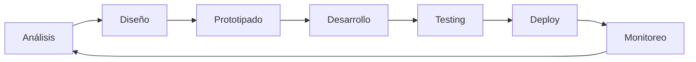

# 🧑🏻‍💻 Andrei Santana

<div align="center">
  
</div>

🇺🇸 [**English**](../README.md) &nbsp;&nbsp;|&nbsp;&nbsp; 🇵🇹 [**Português**](README_pt-PT.md)

## 💻 Stack Tecnológico


## 👨‍💻 Sobre Mí

**Desarrollador Full Stack** con **14+ años** de experiencia creando soluciones robustas y escalables. Especialista en **arquitectura de software**, **liderazgo técnico** y **mejores prácticas de desarrollo**.

Mi pasión es transformar ideas complejas en código limpio y eficiente, aplicando patrones de diseño y metodologías ágiles para entregar valor real a los negocios.

---

## 🛠️ Tecnologías Principales

###  **Ecosistema PHP**

```php
<?php
// Mi stack PHP preferido
$expertise = [
    'frameworks' => ['Laravel', 'Zend Framework', 'CakePHP'],
    'patterns' => ['MVC', 'Repository', 'Service Layer', 'Factory'],
    'standards' => ['PSR-4', 'PSR-12', 'PSR-7', 'PSR-15'],
    'testing' => ['PHPUnit', 'Pest', 'TDD', 'BDD'],
    'tools' => ['Composer', 'PHP-CS-Fixer', 'PHPStan', 'Rector']
];
```

###  **Universo JavaScript**

```javascript
// Tecnologías que domino en el ecosistema JS
const stack = {
    frameworks: ["React", "Angular", "Vue.js"],
    runtime: ["Node.js", "Bun"],
    tools: ["Webpack", "Vite", "Babel", "TypeScript"],
    testing: ["Jest", "Cypress", "Vitest"],
    state: ["Redux", "Vuex", "Context API", "RxJS"],
};
```

### 🏗️ **Arquitectura & Patrones**

-   **Clean Architecture** - Separación clara de responsabilidades
-   **Principios SOLID** - Código extensible y mantenible
-   **Design Patterns** - Factory, Strategy, Observer, Command
-   **API Design** - RESTful, GraphQL, enfoque API-First
-   **Microservicios** - Descomposición y comunicación entre servicios
-   **Event-Driven Architecture** - Sistemas reactivos y escalables

---

## 🎯 Áreas de Especialización

### 💼 **Soluciones Empresariales**

-   **Sistemas ERP** - Gestión completa de recursos empresariales
-   **Plataformas SaaS** - Aplicaciones multi-tenant escalables
-   **E-commerce** - Desde MVPs hasta plataformas complejas
-   **CRM/CMS** - WordPress, Adobe Experience Manager
-   **APIs & Integraciones** - Conectando sistemas heterogéneos

### 📊 **Marketing & Analytics**

-   **Marketing Digital** - Automatizaciones y campañas
-   **Ecosistema Google** - Analytics, Tag Manager, Ads API
-   **Salesforce Marketing Cloud** - Journeys y automatizaciones
-   **Data Analytics** - ETL, dashboards y reportes
-   **SEO Técnico** - Performance y optimizaciones

### ☁️ **DevOps & Infraestructura**

```yaml
# Mi enfoque DevOps
infrastructure:
    containers: [Docker, Kubernetes]
    cloud: [AWS, DigitalOcean]
    ci_cd: [GitHub Actions, GitLab CI, Jenkins]
    monitoring: [New Relic, Sentry, Grafana]

code_quality:
    version_control: [Git, GitFlow, Conventional Commits]
    code_review: [Pull Requests, Code Standards]
    testing: [Unit, Integration, E2E]
    deployment: [Blue-Green, Rolling, Canary]
```

---

## 🧪 Clean Code & Testing

### 📋 **Principios que Sigo**

-   **Clean Code** - Código legible como prosa
-   **TDD/BDD** - Tests como documentación viva
-   **Refactoring** - Mejora continua del código
-   **Code Review** - Calidad a través de colaboración
-   **Documentación** - Código autodocumentado y APIs claras

### 🧩 **Patrones & Prácticas**

-   **Repository Pattern** - Abstracción de acceso a datos
-   **Service Layer** - Lógica de negocio centralizada
-   **Dependency Injection** - Bajo acoplamiento y alta testabilidad
-   **Event-Driven** - Comunicación asíncrona entre componentes
-   **Factory & Builder** - Creación flexible de objetos complejos

---

## 🎨 Especialización Frontend

### ⚛️ **Frontend Moderno**

-   **Arquitectura de Componentes** - Reutilización y modularidad
-   **Gestión de Estado** - Flujos de datos complejos
-   **Performance** - Lazy loading, code splitting, PWA
-   **UX/UI** - Design systems y accesibilidad
-   **Mobile-First** - Responsive y progressive enhancement

### 🎛️ **CMS & Plataformas**

-   **WordPress** - Themes, plugins, bloques Gutenberg
-   **Adobe Experience Manager** - Gestión de contenido empresarial
-   **Headless CMS** - Strapi, Contentful, arquitecturas desacopladas
-   **E-commerce** - WooCommerce, Magento, soluciones personalizadas

---

## 🏢 Liderazgo & Arquitectura

### 👥 **Liderazgo Técnico**

-   **Mentoring de Equipos** - Desarrollo de desarrolladores
-   **Estándares de Código** - Establecimiento de mejores prácticas
-   **Decisiones de Arquitectura** - ADRs y documentación técnica
-   **Metodologías Ágiles** - Scrum, Kanban, planificación de sprints
-   **Compartir Conocimiento** - Tech talks y code reviews

### 🏗️ **System Design**

-   **Planificación de Escalabilidad** - Crecimiento sostenible
-   **Optimización de Performance** - Profiling y optimizaciones
-   **Security First** - OWASP, auditorías y mejores prácticas
-   **Database Design** - Modelado eficiente e índices
-   **Monitoring & Observability** - Logs, métricas y alertas

---

## 🚀 Proyectos & Soluciones

### 💡 **Tipos de Proyectos que Desarrollo**

-   **Plataformas SaaS** - Desde MVP hasta escala empresarial
-   **APIs Robustas** - RESTful y GraphQL con documentación
-   **Sistemas de Gestión** - ERPs, CRMs, dashboards administrativos
-   **E-commerce** - Marketplaces, tiendas online, pasarelas de pago
-   **Automatizaciones** - Workflows, integraciones, data pipelines
-   **Migración de Sistemas** - Legacy a arquitecturas modernas

### 🔧 **Enfoque Técnico**

1. **Discovery** - Comprensión profunda del dominio
2. **Arquitectura** - Diseño de sistema y especificaciones técnicas
3. **Desarrollo** - Código limpio con tests
4. **Deployment** - CI/CD y monitoreo
5. **Iteración** - Feedback loops y mejoras continuas

---

## 📚 Filosofía de Desarrollo

> **"Code is read much more often than it is written."** - _Guido van Rossum_

### 🎯 **Mis Valores**

-   **Simplicidad** - Soluciones elegantes para problemas complejos
-   **Calidad** - Preferir hacerlo bien que hacerlo rápido
-   **Evolución** - Aprendizaje continuo y adaptación
-   **Colaboración** - Conocimiento compartido multiplica valor
-   **Impacto** - Tecnología que resuelve problemas reales

### 🔄 **Proceso de Trabajo**



---

## 📞 ¿Hablamos?

Siempre estoy interesado en **proyectos desafiantes** y **colaboraciones técnicas**. Si tienes una idea, un problema complejo que resolver, o simplemente quieres discutir arquitectura de software, ¡hablemos!

[](https://linkedin.com/in/andreisantana) [](mailto:andreisantana@gmail.com) [](https://github.com/andreisantana)

**💻 Disponible para proyectos freelance y consultoría técnica**

---


