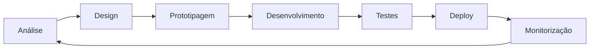

# 🧑🏻‍💻 Andrei Santana

<div align="center">
  
</div>

🇺🇸 [**English**](../README.md) &nbsp;&nbsp;|&nbsp;&nbsp; 🇪🇸 [**Español**](README_es.md)

## 💻 Stack Tecnológica


## 👨‍💻 Sobre Mim

**Desenvolvedor Full Stack** com **14+ anos** de experiência a criar soluções robustas e escaláveis. Especialista em **arquitectura de software**, **liderança técnica** e **boas práticas de desenvolvimento**.

A minha paixão é transformar ideias complexas em código limpo e eficiente, aplicando padrões de design e metodologias ágeis para entregar valor real aos negócios.

---

## 🛠️ Tecnologias Principais

###  **Ecossistema PHP**

```php
<?php
// A minha stack PHP preferida
$expertise = [
    'frameworks' => ['Laravel', 'Zend Framework', 'CakePHP'],
    'patterns' => ['MVC', 'Repository', 'Service Layer', 'Factory'],
    'standards' => ['PSR-4', 'PSR-12', 'PSR-7', 'PSR-15'],
    'testing' => ['PHPUnit', 'Pest', 'TDD', 'BDD'],
    'tools' => ['Composer', 'PHP-CS-Fixer', 'PHPStan', 'Rector']
];
```

###  **Universo JavaScript**

```javascript
// Tecnologias que domino no ecossistema JS
const stack = {
    frameworks: ["React", "Angular", "Vue.js"],
    runtime: ["Node.js", "Bun"],
    tools: ["Webpack", "Vite", "Babel", "TypeScript"],
    testing: ["Jest", "Cypress", "Vitest"],
    state: ["Redux", "Vuex", "Context API", "RxJS"],
};
```

### 🏗️ **Arquitectura & Padrões**

-   **Clean Architecture** - Separação clara de responsabilidades
-   **Princípios SOLID** - Código extensível e mantível
-   **Design Patterns** - Factory, Strategy, Observer, Command
-   **API Design** - RESTful, GraphQL, abordagem API-First
-   **Microserviços** - Decomposição e comunicação entre serviços
-   **Event-Driven Architecture** - Sistemas reactivos e escaláveis

---

## 🎯 Áreas de Especialização

### 💼 **Soluções Empresariais**

-   **Sistemas ERP** - Gestão completa de recursos empresariais
-   **Plataformas SaaS** - Aplicações multi-tenant escaláveis
-   **E-commerce** - Desde MVPs até plataformas complexas
-   **CRM/CMS** - WordPress, Adobe Experience Manager
-   **APIs & Integrações** - Ligação entre sistemas heterogéneos

### 📊 **Marketing & Analytics**

-   **Marketing Digital** - Automatizações e campanhas
-   **Ecossistema Google** - Analytics, Tag Manager, Ads API
-   **Salesforce Marketing Cloud** - Jornadas e automatizações
-   **Data Analytics** - ETL, dashboards e relatórios
-   **SEO Técnico** - Performance e optimizações

### ☁️ **DevOps & Infraestrutura**

```yaml
# A minha abordagem DevOps
infrastructure:
    containers: [Docker, Kubernetes]
    cloud: [AWS, DigitalOcean]
    ci_cd: [GitHub Actions, GitLab CI, Jenkins]
    monitoring: [New Relic, Sentry, Grafana]

code_quality:
    version_control: [Git, GitFlow, Conventional Commits]
    code_review: [Pull Requests, Code Standards]
    testing: [Unit, Integration, E2E]
    deployment: [Blue-Green, Rolling, Canary]
```

---

## 🧪 Clean Code & Testing

### 📋 **Princípios que Sigo**

-   **Clean Code** - Código legível como prosa
-   **TDD/BDD** - Testes como documentação viva
-   **Refactoring** - Melhoria contínua do código
-   **Code Review** - Qualidade através de colaboração
-   **Documentação** - Código autodocumentado e APIs claras

### 🧩 **Padrões & Práticas**

-   **Repository Pattern** - Abstracção de acesso a dados
-   **Service Layer** - Lógica de negócio centralizada
-   **Dependency Injection** - Baixo acoplamento e alta testabilidade
-   **Event-Driven** - Comunicação assíncrona entre componentes
-   **Factory & Builder** - Criação flexível de objectos complexos

---

## 🎨 Especialização Frontend

### ⚛️ **Frontend Moderno**

-   **Arquitectura de Componentes** - Reutilização e modularidade
-   **Gestão de Estado** - Fluxos de dados complexos
-   **Performance** - Lazy loading, code splitting, PWA
-   **UX/UI** - Design systems e acessibilidade
-   **Mobile-First** - Responsive e progressive enhancement

### 🎛️ **CMS & Plataformas**

-   **WordPress** - Themes, plugins, blocos Gutenberg
-   **Adobe Experience Manager** - Gestão de conteúdo empresarial
-   **Headless CMS** - Strapi, Contentful, arquitecturas desacopladas
-   **E-commerce** - WooCommerce, Magento, soluções personalizadas

---

## 🏢 Liderança & Arquitectura

### 👥 **Liderança Técnica**

-   **Mentoring de Equipas** - Desenvolvimento de programadores
-   **Padrões de Código** - Estabelecimento de boas práticas
-   **Decisões de Arquitectura** - ADRs e documentação técnica
-   **Metodologias Ágeis** - Scrum, Kanban, planeamento de sprints
-   **Partilha de Conhecimento** - Tech talks e code reviews

### 🏗️ **System Design**

-   **Planeamento de Escalabilidade** - Crescimento sustentável
-   **Optimização de Performance** - Profiling e optimizações
-   **Security First** - OWASP, auditorias e boas práticas
-   **Database Design** - Modelagem eficiente e índices
-   **Monitoring & Observability** - Logs, métricas e alertas

---

## 🚀 Projectos & Soluções

### 💡 **Tipos de Projectos que Desenvolvo**

-   **Plataformas SaaS** - Desde MVP até escala empresarial
-   **APIs Robustas** - RESTful e GraphQL com documentação
-   **Sistemas de Gestão** - ERPs, CRMs, dashboards administrativos
-   **E-commerce** - Marketplaces, lojas online, gateways de pagamento
-   **Automatizações** - Workflows, integrações, data pipelines
-   **Migração de Sistemas** - Legacy para arquitecturas modernas

### 🔧 **Abordagem Técnica**

1. **Discovery** - Compreensão profunda do domínio
2. **Arquitectura** - Design de sistema e especificações técnicas
3. **Desenvolvimento** - Código limpo com testes
4. **Deployment** - CI/CD e monitorização
5. **Iteração** - Feedback loops e melhorias contínuas

---

## 📚 Filosofia de Desenvolvimento

> **"Code is read much more often than it is written."** - _Guido van Rossum_

### 🎯 **Os Meus Valores**

-   **Simplicidade** - Soluções elegantes para problemas complexos
-   **Qualidade** - Preferir fazer bem do que fazer depressa
-   **Evolução** - Aprendizagem contínua e adaptação
-   **Colaboração** - Conhecimento partilhado multiplica valor
-   **Impacto** - Tecnologia que resolve problemas reais

### 🔄 **Processo de Trabalho**



---

## 📞 Vamos Conversar?

Estou sempre interessado em **projectos desafiadores** e **colaborações técnicas**. Se tem uma ideia, um problema complexo para resolver, ou simplesmente quer discutir arquitectura de software, vamos conversar!

[](https://linkedin.com/in/andreisantana) [](mailto:andreisantana@gmail.com) [](https://github.com/andreisantana)

**💻 Disponível para projectos freelance e consultoria técnica**

---


